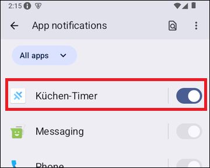

# Ionic-App "Küchen-Timer" (Kitchen Timer) #

 

Diese Repository enthält ein [Ionic](https://ionicframework.com/)/Angular-Projekt für eine mobile App.
Die App demonstriert das Plugin [local-notifications](https://capacitorjs.com/docs/apis/local-notifications).

Damit die mit dem Plugin erzeugten lokalen Notifikationen funktionieren, müssen diese unter Android für
die App erlaubt werden: `Settings | Notifications | App notifications`

 

 

----

## Screenshots ##

 

 

----

## License ##

 

See the [LICENSE file](LICENSE.md) for license rights and limitations (BSD 3-Clause License)
for the files in this repository.

 
