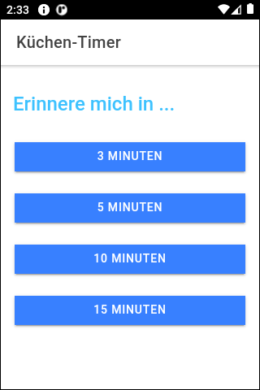
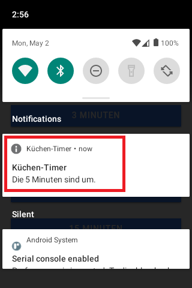

# Ionic-App "Küchen-Timer" (kitchen timer) #

Simple [Ionic](https://ionicframework.com/) app with [Capacitor](https://capacitorjs.com/docs) to demonstrate the usage of the plugin for [local-notifications](https://capacitorjs.com/docs/apis/local-notifications).

 

----

## Screenshots ##

 

    

 

----

## License ##

See the [LICENSE file](LICENSE.md) for license rights and limitations (BSD 3-Clause License)
for the files in this repository.
